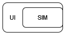

# High Level Design

## Option 1

Run sim and UI as separate processes. The UI will communicate with the sim using a socket connection. The sim will run as a server and the UI will run as a client. The UI will send commands to the sim and the sim will send back the state. The UI will then update the display based on the state.
- Use protobufs for serialization/deserialization
- Pre-defined API

Pros:
- Decouples the sim and UI so they can be developed independently
- Can run standalone sim without UI
- Can later change sim/UI to different language and still use the same UI
- Easy to maintain and extend

Cons:
- More complex to implement
    - Need to worry about serialization/deserialization, socket communication and API

## Option 2

Run sim and UI in the same process. The UI will own the sim and will call sim functions directly and access sim objects directly.

Pros:
- Easier to implement
- No need to worry about serialization/deserialization, socket communication and API

Cons:
- Sim and UI are tightly coupled
    - Difficult to change either without affecting the other

## Final Decision

I decided to go with option 1. The pros of option 1 outweigh the cons. The decoupling of sim and UI will make it easier to maintain and extend the code in the long run. Additionally, I want to learn how to work with sockets and protobufs, so this will be a good opportunity to do so.
